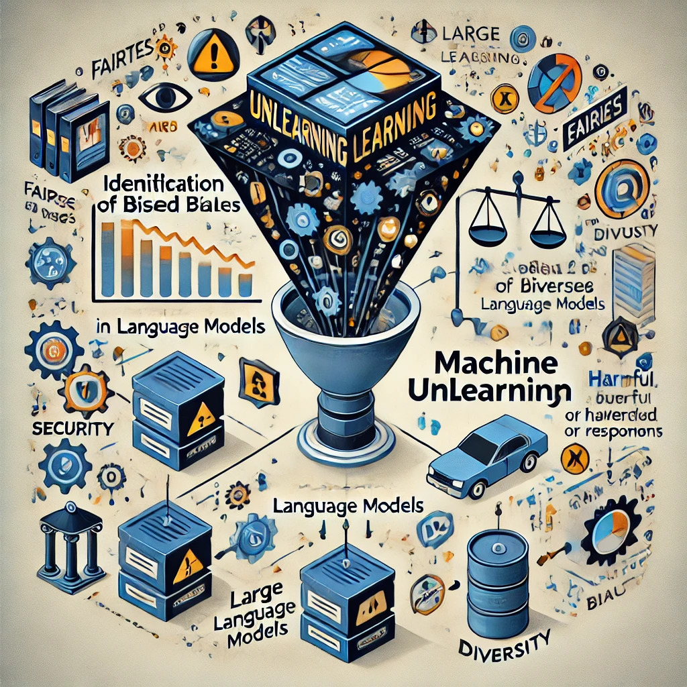

# Biases and Machine Unlearning in Language Models (LLMs)

This is curated repository of resources on bias and machine unlearning in Large Language Models. Its primary purpose is to provide a comprehensive list of relevant resources related to these topics that can support my research and dissertation, under the advisorship of [PhD Edna Dias Canedo](https://ednacanedo.github.io/), in the [Professional Graduate Program in Electrical Engineering (PPEE)](https://ppee.unb.br/) at the [University of Brasília (UnB)](https://international.unb.br/), [Department of Electrical Engineering (ENE)](http://www.ene.unb.br/).

# Table of Contents
- [Paper List :page_with_curl:](#awesome-trustworthy--deep-learning)
- [Related Awesome Lists :astonished:](#related-awesome-lists)
- [Toolboxes :toolbox:](#toolboxes)
- [Seminar :alarm_clock:](#seminar) 
- [Workshops :fire:](#workshops)
- [Tutorials :woman_teacher:](#tutorials)
- [Talks :microphone:](#talks)
- [Blogs :writing_hand:](#blogs)
- [Other Resources :sparkles:](#other-resources)

# Paper List

# Related Awesome Lists

| **Title** | **Topics** |  | 
| --------------- | ---- | ---- | 
| [Awesome-GenAI-Unlearning](https://github.com/franciscoliu/Awesome-GenAI-Unlearning) | [Generative-AI](https://github.com/topics/Generative-AI) [Machine-Unlearning](https://github.com/topics/Machine-Unlearning) |   |
| [Awesome Large Language Model Unlearning](https://github.com/chrisliu298/awesome-llm-unlearning) | [Machine-Unlearning](https://github.com/topics/machine-unlearning) [LLM-Unlearning](https://github.com/topics/llm-unlearning) |   |
| [Awesome Trustworthy Deep Learning](https://github.com/MinghuiChen43/awesome-trustworthy-deep-learning) | [Trustworthy-AI](https://github.com/topics/trustworthy-ai) |   |
| [LLM-Unlearning-Paper-List](https://github.com/KID-22/LLM-Unlearning-Paper-List) | [Machine-Unlearning](https://github.com/topics/machine-unlearning) [LLM-Unlearning](https://github.com/topics/llm-unlearning) |   |

# Toolboxes

# Seminar

# Workshops

# Talks

# Blogs

# Tutorials

# Other Resources